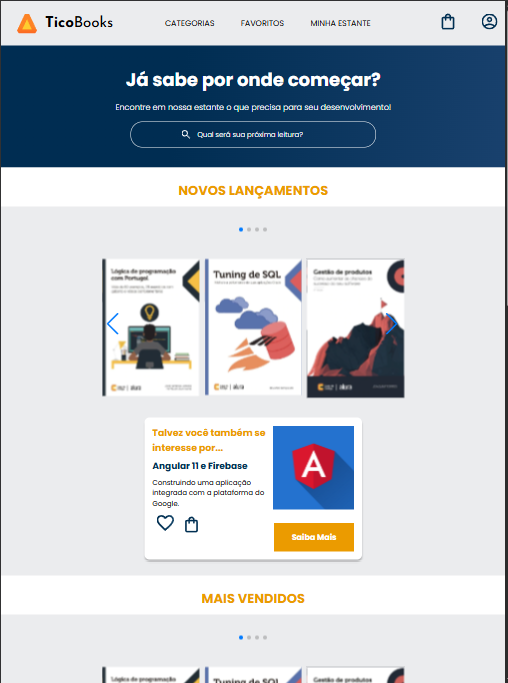
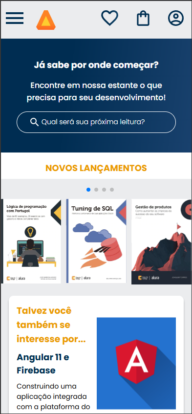
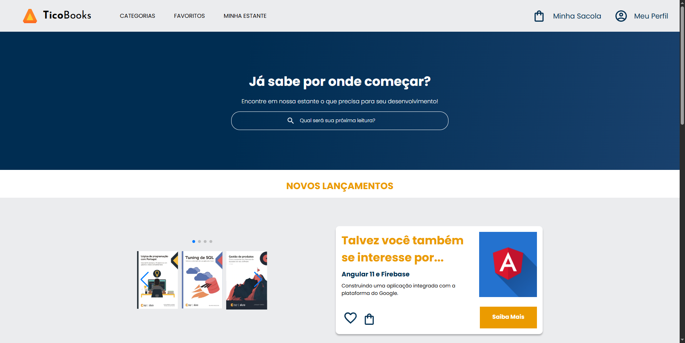

# TicoBooks 📚
TicoBooks é um projeto de página web inspirado em sites de livros, com foco especial na responsividade — adaptando a experiência do usuário para diferentes dispositivos como celulares, tablets e desktops.

## ✨ Sobre o projeto
O objetivo principal do TicoBooks foi criar uma interface limpa, amigável e totalmente responsiva, garantindo que o site se ajuste de forma elegante a diferentes tamanhos de tela.

## 🚀 Tecnologias utilizadas
- HTML5: Estruturação do conteúdo da página

- CSS3: Estilização, layout responsivo e animações

- JavaScript (mínimo): Pequenas interações para aprimorar a experiência do usuário

## 📱 Responsividade
O design do TicoBooks foi pensado para se adaptar automaticamente:

Mobile-first: Priorizando usuários de smartphones

Tablets: Layouts ajustáveis e fluidos

Desktop: Visual amplo e otimizado para grandes telas

## 🖼️ Pré-visualizações

### 📱 Versão Mobile

### 📱 Versão Tablet

### 💻 Versão Desktop

## 🔥 Extras
- Projeto leve e simples, focado na prática de boas práticas de responsividade.

- Ideal para servir de base para projetos maiores ou ser expandido com funcionalidades mais avançadas.

